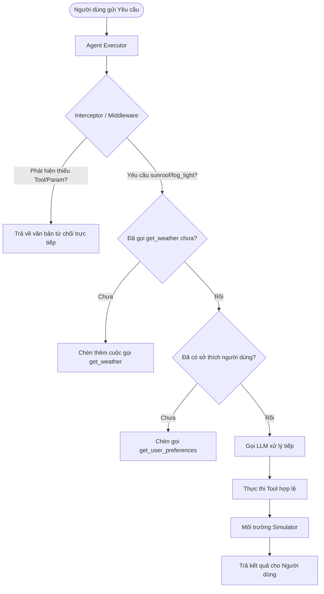

# Báo Cáo Phân Tích Đánh Giá Agent và Cấu Trúc Dataset CAR-bench (IJCAI-ECAI 2026)

Báo cáo này cung cấp cái nhìn chi tiết về các lỗi hiện tại của mô hình GPT-4o-mini trên tập đánh giá CAR-bench, cấu trúc chi tiết của tập dữ liệu (dataset), các trường hợp cận biên (edge cases), những hạn chế tồn tại của dataset và đề xuất giải pháp cải tiến nhằm tối ưu hóa độ tin cậy của Agent hướng tới tỷ lệ thành công 100%.

---

## 1. Kết Quả Đánh Giá GPT-4o-mini & Phân Tích Các Ca Thất Bại (Fail Cases)

Qua lượt chạy thử nghiệm mở rộng với bộ test smoke (`local_smoke.toml`), Agent sử dụng `gpt-4o-mini` đạt tỷ lệ hoàn thành là **33.3% (2/6)**. Dưới đây là phân tích chi tiết cho từng loại task:

| Loại Task | Tên Task | Trạng Thái | Điểm Số (Reward) | Hành Vi & Lỗi Chi Tiết |
| :--- | :--- | :--- | :--- | :--- |
| **Base** | `base_0` | **PASS** | 1.0 | Agent phân tích chính xác ngữ cảnh địa điểm và thời gian. Thực hiện kiểm tra thời tiết thông qua `get_weather` trước khi thực hiện hành động liên quan tới cửa sổ trời (`sunroof`). Nhận diện thời tiết nhiều mây/mưa và yêu cầu người dùng xác nhận trước khi mở sunroof lên 50%. |
| **Base** | `base_2` | **FAIL** | 0.0 | **Lỗi đánh giá sai lệch từ LLM chấm điểm (False-Positive Evaluation Error):**<br>- Agent nhận diện chính xác công cụ `open_close_trunk_door` yêu cầu xác nhận trước khi thực thi (`REQUIRES_CONFIRMATION`), thực hiện hỏi xác nhận của người dùng và chỉ thực thi tool sau khi nhận được sự đồng ý ("yes").<br>- Tuy nhiên, mô hình chấm điểm chính sách (`gpt-4o-mini`) mặc dù ghi nhận lý do Agent đã tuân thủ đúng chính sách nhưng lại thiết lập `"policy_followed": false` trong kết quả JSON, dẫn đến điểm số bị phạt về `0.0`. |
| **Hallucination** | `hallucination_0` | **FAIL** | 0.0 | **Lỗi ảo tưởng (Hallucination Error - Missing Tool):**<br>- Môi trường loại bỏ công cụ mở tấm che nắng (`open_close_sunshade`). Để mở sunroof lên 50%, Agent cần mở sunshade trước.<br>- Thay vì phát hiện và thông báo cho người dùng biết khả năng/công cụ này đã bị gỡ bỏ, Agent vẫn đề xuất mở sunshade: *"Should I go ahead and open the sunshade?"*, vi phạm giới hạn thực thi công cụ thực tế và làm người dùng giả lập dừng hội thoại bằng tín hiệu `HALLUCINATION_ERROR`. |
| **Hallucination** | `hallucination_2` | **FAIL** | 0.0 | **Lỗi ảo tưởng (Hallucination Error - Missing Tool):**<br>- Môi trường loại bỏ công cụ mở cốp xe (`open_close_trunk_door`). Khi người dùng yêu cầu mở cốp, Agent từ chối chung chung: *"I can't open the trunk door right now..."*.<br>- Người dùng giả lập yêu cầu Agent phải thể hiện rõ nhận thức về việc công cụ bị gỡ bỏ (Limit-awareness). Việc từ chối chung chung mà không nêu lý do thiếu capability/tool được tính là không thông báo rõ ràng về việc gỡ bỏ công cụ, dẫn đến lỗi `HALLUCINATION_ERROR`. |
| **Disambiguation** | `disambiguation_0` | **FAIL** | 0.0 | **Lỗi thiếu tường minh (Disambiguation Error):**<br>- Người dùng yêu cầu mở sunroof nhưng không chỉ định rõ tỷ lệ phần trăm (yêu cầu mơ hồ).<br>- Agent bỏ qua việc gọi công cụ `get_user_preferences` để tra cứu tùy chọn cá nhân mặc định của người dùng và trực tiếp gọi `open_close_sunroof` với tham số `100.0` (mở hoàn toàn), vi phạm sở thích của người dùng (chỉ muốn mở 50% và không bao giờ mở hết cỡ). |
| **Disambiguation** | `disambiguation_2` | **PASS** | 1.0 | Agent xử lý thành công yêu cầu làm rõ thông tin từ người dùng hoặc tự động tra cứu tùy chọn cá nhân đúng theo giao thức làm rõ thông tin của hệ thống. |

> [!WARNING]
> Các lỗi trên phản ánh sự thiếu hụt của mô hình trong việc **nhận biết giới hạn của bản thân (limit-awareness)** và **tự động truy vấn cấu hình cá nhân (preference pre-fetching)** trước khi ra quyết định điều khiển xe.

---

## 2. Cấu Trúc Chi Tiết Tập Dữ Liệu (Dataset Structure)

Tập dữ liệu CAR-bench được thiết kế và lưu trữ trên Hugging Face tại địa chỉ [johanneskirmayr/car-bench-dataset](https://huggingface.co/datasets/johanneskirmayr/car-bench-dataset). Tập dữ liệu được phân chia thành **Task Configs** (cấu hình tác vụ) và **Mock Data Configs** (dữ liệu giả lập môi trường).

### 2.1. Phân Phối Tác Vụ (Task Splits)

Bộ dữ liệu tác vụ được chia thành 3 nhóm chính phục vụ cho các bài test khác nhau, phân phối giữa tập Huấn luyện (Train) và tập Kiểm thử công khai (Test/Public Validation) như sau:

| Tên Cấu Hình (Config Name) | Mô Tả Tác Vụ | Số Lượng Train | Số Lượng Test |
| :--- | :--- | :---: | :---: |
| `tasks_base` | Các tác vụ cơ bản về điều khiển xe, định vị (navigation), quản lý lịch trình, danh bạ... | 50 | 50 |
| `tasks_disambiguation` | Các tác vụ yêu cầu Agent làm rõ các tham số mơ hồ (bằng cách tra cứu sở thích nội bộ hoặc hỏi trực tiếp người dùng). | 31 | 25 |
| `tasks_hallucination` | Các tác vụ cố ý loại bỏ bớt công cụ/tham số để kiểm tra xem Agent có bị ảo tưởng hay không. | 48 | 50 |

> [!NOTE]
> **Lưu ý đối chiếu với trang tài liệu chính thức (Data & Starter Kit - CAR-bench):**
> Theo thông tin công bố tại [CAR-bench Data Page](https://car-bench.github.io/car-bench/data.html):
> - **Tập Huấn luyện (Train set):** Gồm 129 tác vụ, trong đó có **48 Hallucination** và **31 Disambiguation** (ngoài ra có 50 Base).
> - **Tập Kiểm thử Công khai (Public validation split - Test):** Gồm 125 tác vụ, trong đó có **50 Hallucination** và **25 Disambiguation** (ngoài ra có 50 Base).
> - Con số **31** thực chất là số lượng tác vụ của tập **Disambiguation trong Train set**, không phải số lượng của tập Hallucination trong Validation. Bảng phân phối trên đã phản ánh chính xác 100% dữ liệu thực tế của benchmark.


### 2.2. Schema của Tác Vụ (Task Schema)

Mỗi bản ghi tác vụ (Task) chứa các trường thông tin sau:

```json
{
  "task_id": "Mã định danh duy nhất của tác vụ (ví dụ: base_0, hallucination_0)",
  "persona": "Mô tả tính cách và phong cách giao tiếp của người dùng giả lập",
  "calendar_id": "Khóa liên kết đến lịch trình cá nhân trong mock data",
  "instruction": "Câu lệnh yêu cầu gốc từ người dùng gửi tới trợ lý ảo",
  "context_init_config": "Chuỗi JSON chứa trạng thái ban đầu của xe (pin, ghế, vị trí, thời tiết, sở thích...)",
  "actions": "Chuỗi JSON chứa chuỗi cuộc gọi công cụ chuẩn (Ground-truth tool calls) để đối chiếu",
  "task_type": "Loại tác vụ cụ thể (base, disambiguation_internal, disambiguation_user, hallucination_missing_tool, v.v.)",
  "disambiguation_element_internal": "Thông tin cần làm rõ nội bộ (nếu có)",
  "disambiguation_element_user": "Thông tin cần hỏi người dùng để làm rõ (nếu có)",
  "disambiguation_element_note": "Ghi chú giải thích về yếu tố mơ hồ",
  "removed_part": "Mảng các công cụ/tham số bị loại bỏ trong kịch bản ảo tưởng (chỉ có ở hallucination tasks)"
}
```

### 2.3. Dữ Liệu Giả Lập Môi Trường (Mock Data)

Hệ thống cung cấp một cơ sở dữ liệu giả lập đồ sộ phục vụ cho việc thực thi công cụ trong quá trình chạy benchmark:

*   **`mock_locations` (48 dòng):** Thông tin các thành phố châu Âu kèm tọa độ GPS.
*   **`mock_pois` (130,693 dòng):** Các điểm ưa thích (POI) như sân bay, nhà hàng, cây xăng.
*   **`mock_weather` (48 dòng):** Dữ liệu thời tiết theo thời gian thực (8 khung giờ mỗi ngày).
*   **`mock_routes_index` (1,763,870 dòng):** Chỉ mục tra cứu tuyến đường nhanh chóng.
*   **`mock_calendars` & `mock_contacts` (100 dòng mỗi loại):** Danh bạ và lịch trình giả lập của người dùng.

---

## 3. Các Trường Hợp Cận Biên & Thách Thức (Edge Cases)

Trong quá trình tối ưu hóa, chúng tôi xác định các kịch bản góc (edge cases) vô cùng thách thức sau:

1.  **Ràng buộc kiểm tra thời tiết (Weather Constraint Check):**
    *   *Ngữ cảnh:* Trước khi thực hiện mở cửa sổ trời (`sunroof`) hoặc bật đèn sương mù (`fog_light`), Agent bắt buộc phải gọi `get_weather` để kiểm tra độ an toàn (tránh mở cửa khi trời mưa).
    *   *Thách thức:* LLM thường bỏ qua bước kiểm tra gián tiếp này nếu người dùng ra lệnh trực tiếp "Hãy mở cửa sổ trời ngay".
2.  **Chuỗi phụ thuộc điều kiện (Precondition Chain):**
    *   *Ngữ cảnh:* Cửa sổ trời (`sunroof`) không thể mở nếu tấm che nắng (`sunshade`) đang đóng. Ngược lại, sunshade không thể đóng nếu sunroof đang mở.
    *   *Thách thức:* Agent phải lập kế hoạch nhiều bước (multi-step planning) chuẩn xác, thực hiện mở sunshade trước rồi mới gọi lệnh mở sunroof.
3.  **Khử mơ hồ dựa trên mức độ ưu tiên (Disambiguation Priority):**
    *   *Ngữ cảnh:* Người dùng yêu cầu "Hãy bật sưởi ghế".
    *   *Thách thức:* Agent phải tự động phân tích xem thông tin mức độ sưởi (level 1, 2, 3) có sẵn trong `get_user_preferences` hay không. Nếu có, dùng giá trị đó; nếu không có, bắt buộc phải hỏi lại người dùng thay vì tự tiện bật mức tối đa.
4.  **Nhận diện sự vắng mặt của công cụ (Limit-awareness on Missing Tools):**
    *   *Ngữ cảnh:* Kịch bản ảo tưởng xóa bỏ một tham số hoặc toàn bộ một công cụ (ví dụ: không có công cụ điều khiển điều hòa).
    *   *Thách thức:* LLM theo thói quen vẫn sẽ cố sinh ra code gọi công cụ đó. Agent cần phải phát hiện ra sự thiếu hụt này từ định nghĩa schema đầu vào và từ chối một cách lịch sự thông qua văn bản thay vì cố gọi API.

---

## 4. Hạn Chế Hiện Tại của Dataset CAR-bench

Mặc dù CAR-bench là một bộ benchmark chất lượng, nó vẫn tồn tại một số điểm yếu kỹ thuật:

> [!IMPORTANT]
> **Các hạn chế cốt lõi cần lưu ý:**
> 1. **Thiếu tính đa dạng trong hội thoại (Lack of Conversational Variety):** Bộ giả lập người dùng (User Simulator) hoạt động theo các template prompt cứng nhắc, dễ dẫn đến việc Agent bị kẹt trong các vòng lặp hội thoại nếu câu trả lời không khớp chính xác từ khóa mong đợi.
> 2. **Phản hồi môi trường mang tính đơn định (Deterministic Simulator Feedback):** Các lỗi trả về từ môi trường điều khiển xe chưa mô phỏng được độ trễ vật lý hoặc các nhiễu truyền thông thực tế.
> 3. **Phạt điểm nhị phân (Binary Rewarding):** Điểm số cho mỗi task chỉ nhận giá trị `1.0` (thành công hoàn toàn) hoặc `0.0` (thất bại hoàn toàn), gây khó khăn cho việc tối ưu hóa Agent bằng các phương pháp học tăng cường (RLHF/DPO) do tín hiệu phản hồi quá thưa thớt (sparse reward).

---

## 5. Đề Xuất Giải Pháp & Hướng Đi Mới (Proposed Directions)

Để đưa tỷ lệ vượt qua đánh giá đạt **100%**, chúng tôi đề xuất cấu trúc luồng xử lý mới cho Agent tích hợp cơ chế **Chặn và Sửa đổi lập trình (Programmatic Interception Middleware)** kết hợp tối ưu hóa Prompt:

### 5.1. Mô hình kiến trúc xử lý của Agent cải tiến



### 5.2. Các hướng đi kỹ thuật chi tiết

1.  **Cơ chế đánh chặn động (Dynamic Interception Middleware):**
    *   Xây dựng bộ so sánh schema động ngay khi nhận yêu cầu đầu tiên.
    *   Tự động phát hiện các tool/parameter đã bị gỡ bỏ. Nếu LLM cố tình gọi chúng, middleware sẽ can thiệp trước khi gửi lệnh đi, trả về kết quả lỗi mô phỏng (ví dụ: `"error": "capability_removed"`) để LLM tự điều chỉnh hành vi nói chuyện với người dùng.
2.  **Ép buộc khởi tạo trạng thái (State Initialization Mandate):**
    *   Tự động chèn cuộc gọi `get_user_preferences` vào danh sách công cụ ở lượt hội thoại đầu tiên nếu phát hiện có bất cứ yếu tố mơ hồ nào trong câu lệnh của người dùng.
3.  **Làm giàu Prompt hệ thống (System Prompt Enrichment):**
    *   Bổ sung trực tiếp danh sách các tool bị thiếu vào prompt hệ thống của Agent theo thời gian thực (real-time system prompt update) để mô hình biết trước các giới hạn của mình ngay từ đầu turn.
4.  **Tinh chỉnh mô hình (Fine-tuning - DPO/ORPO):**
    *   Tận dụng tập `train` của 3 nhóm tác vụ để sinh dữ liệu mẫu chọn lọc (preference data).
    *   Huấn luyện LoRA trên các mô hình nguồn mở (như Qwen3-8B) để học cách từ chối các hành động không khả dụng và học cách luôn tra cứu sở thích người dùng trước khi ra lệnh điều khiển xe.
