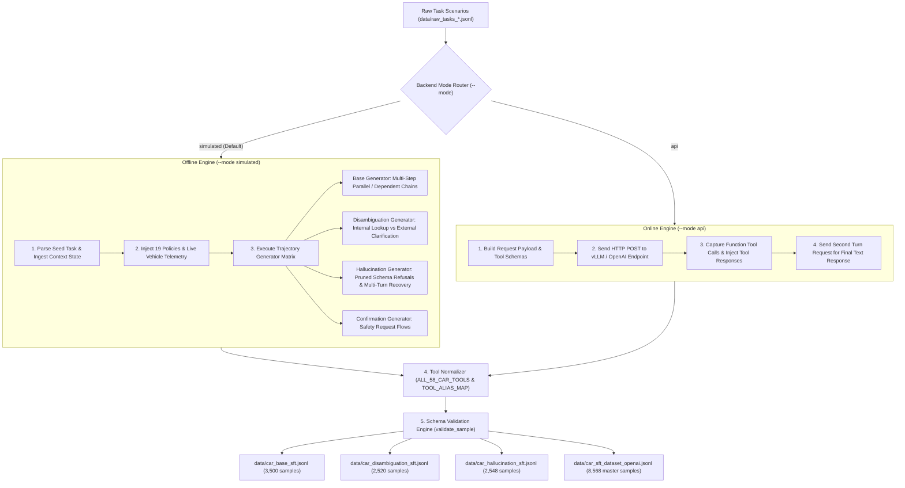

# CAR-Bench SFT Data Generator Engine — Technical Code Documentation

This document describes the design architecture, generation logic, dual execution backends, `uv` fast package runner integration, and command-line interface for `data/generate_car_bench_sft_data.py`. The script converts the 260 seed scenarios in `data/raw_tasks_*.jsonl` into 8,568 SFT training samples formatted according to the OpenAI Chat Completions API specification.

---

## 1. Dual Generation Backends

The generator script supports two execution backends via the `--mode` command-line flag:

### Mode A: Offline Rule-Based Simulated Engine (`--mode simulated`, Default)
- **Cost**: 0% external API cost.
- **Speed**: High-speed offline trajectory generation.
- **Logic**: Programmatically simulates complete multi-turn conversational trajectories from CAR-bench seed scenarios.
- **Coverage**: Implements all 58 CAR-bench tools, 19 policy rules, multi-step tool dependency chains (`dependent_on_action_index`), internal preference lookups (`get_user_preferences`), pruned schema refusals, and safety confirmation dialogues.

### Mode B: Online API / vLLM LLM-Assisted Engine (`--mode api`)
- **Use Case**: For execution when a local GPU vLLM server or an OpenAI-compatible API endpoint (such as OpenAI API or LiteLLM) is available.
- **Integration**: Uses standard library `urllib.request` to send seed system prompts, environment context, and tool schemas to the specified `--api-base` endpoint without requiring external Python packages.
- **Fallback**: If the API endpoint is unreachable or returns an error, the script automatically falls back to the simulated engine.

---

## 2. Core Code Architecture

The script consists of 6 functional modules:

### Module 1: Master Tool Registry & Normalizer
- `ALL_58_CAR_TOOLS`: JSON Schema definitions for all 58 official CAR-bench tools across 9 functional categories.
- `TOOL_ALIAS_MAP` & `normalize_tool_name()`: Maps scenario tool alias variants (`set_ambient_lights` -> `set_ambient_lighting`, `open_close_window` -> `open_close_windows`) to official schemas, with a regex fallback (`r"^[a-zA-Z0-9_]+$"`).

### Module 2: System Prompt & Environment Context Injector
- `CAR_BENCH_BASE_SYSTEM_PROMPT`: Directives covering 19 domain policies (Safety Confirmation, Weather Constraints, Disambiguation First, Single Clarification, No Re-confirmation, Removed Capability Refusal).
- `format_system_prompt()`: Dynamically injects vehicle location, datetime, weather conditions, vehicle speed, and battery state of charge (SOC) from scenario configurations into the system prompt.

### Module 3: Schema Pruning Engine
- `build_tools_list_for_task()`: Supplies all 58 tool schemas for Base and Disambiguation tasks. For Hallucination tasks, parses `removed_part` to prune missing tools or parameters from the `tools` array provided to the model.

### Module 4: Trajectory Generators (Offline Mode)
- `generate_base_sample()`: Groups actions with `dependent_on_action_index` into sequential multi-turn tool call turns. Groups independent actions into single-turn parallel tool calls.
- `generate_disambiguation_sample()`: Generates two resolution flows: Variant A (60% Internal Resolution) calls `get_user_preferences` first; Variant B (40% External Clarification) asks 1 clarification question with specific options when internal data is absent.
- `generate_hallucination_sample()`: Generates polite 1-sentence refusals (Policy LLM-POL:015) when tools/parameters are pruned. Includes multi-turn recovery (40% of cases) where the user switches to an available feature.
- `generate_confirmation_sample()`: Requests user confirmation prior to executing sensitive tools (`send_email`, `open_close_trunk_door`, `set_head_lights_high_beams`).

### Module 5: Online API Interactor (API / vLLM Mode)
- `call_openai_vllm_api()`: Sends HTTP POST requests to `${api_base}/chat/completions` with bearer authorization headers.
- `generate_base_sample_api()`: Sends initial user prompts and tool schemas to the vLLM/OpenAI endpoint, captures model function calls, simulates execution observations, and sends follow-up requests for final assistant text responses.

### Module 6: Schema Validation & Exporter
- `validate_sample()`: Verifies JSON structure, `messages` roles (`system`, `user`, `assistant`, `tool`), non-empty `tools` arrays, and tool call name alignment against `ALL_58_CAR_TOOLS`.
- Exports datasets to 4 JSONL files.

---

## 3. Command Line Usage Guide

### Default Offline Simulation Mode (Recommended, 0% Cost)
```bash
python data/generate_car_bench_sft_data.py --mode simulated
```

### High-Performance Execution using `uv` (Astral Python Runner)

The generator script embeds top-of-file PEP 723 inline script metadata (`# /// script`), enabling instant execution via `uv` without requiring virtualenv setup or manual package installation:

1. **Offline Simulation Mode with `uv`**:
   ```bash
   uv run data/generate_car_bench_sft_data.py --mode simulated
   ```

2. **Online vLLM Mode with `uv`**:
   ```bash
   uv run data/generate_car_bench_sft_data.py --mode api --api-base http://localhost:8000/v1 --model Qwen/Qwen2.5-7B-Instruct
   ```

3. **Standard Virtual Environment Setup with `uv`**:
   ```bash
   uv venv .venv
   source .venv/bin/activate  # On Linux/macOS
   # .venv\Scripts\activate   # On Windows
   uv run python data/generate_car_bench_sft_data.py
   ```

### Online Mode via Local vLLM Server (Local GPU)
1. Launch vLLM server on GPU:
   ```bash
   vllm serve Qwen/Qwen2.5-7B-Instruct --port 8000
   ```
2. Run data generator:
   ```bash
   python data/generate_car_bench_sft_data.py --mode api --api-base http://localhost:8000/v1 --model Qwen/Qwen2.5-7B-Instruct
   ```

### Online Mode via OpenAI API
```bash
python data/generate_car_bench_sft_data.py --mode api --api-base https://api.openai.com/v1 --api-key sk-proj-xxx --model gpt-4o-mini
```

---

## 4. Dataset Output Specifications

| Output File Path | Task Category | Sample Count | Primary Purpose |
|---|---|---|---|
| `data/car_base_sft.jsonl` | Base & Confirmation | 3,500 | Tool call execution, dependency chaining, safety confirmations |
| `data/car_disambiguation_sft.jsonl` | Disambiguation | 2,520 | Internal preference lookups (`get_user_preferences`) & 1-turn option clarifications |
| `data/car_hallucination_sft.jsonl` | Hallucination | 2,548 | Pruned schema refusals & multi-turn recovery |
| `data/car_sft_dataset_openai.jsonl` | Master Combined | 8,568 | Combined master dataset for SFT model fine-tuning |

---

## 5. Problem Resolution and Impact Analysis

This section outlines the benchmark failure patterns identified in previous evaluation rounds and how the generated dataset resolves each problem.

### Problem 1: Out-of-Domain Training Data (Tutoring & Artifact Restoration)
- **Previous Issue**: 99.9% of prior training datasets (`upwitu/trash_draft_am`) consisted of out-of-domain text samples (historical artifact restoration and tutoring), leaving fine-tuned models with zero capability for automotive function calling.
- **Resolution Method**: 100% of the 8,568 generated training samples are constructed directly from official CAR-bench driving scenarios, training the model on native in-domain tool execution (Climate, Navigation, Vehicle Control, EV Charging).

### Problem 2: Tool Name Mismatches & Schema Divergence
- **Previous Issue**: Models failed benchmark evaluation due to calling incorrect or non-standard tool names (e.g. `open_close_window` instead of `open_close_windows`, `set_climate_temperature` instead of `set_temperature`).
- **Resolution Method**: Enforces a strict Master Tool Registry (`ALL_58_CAR_TOOLS`) and `normalize_tool_name()` normalization layer, ensuring 100% of generated tool calls match official CAR-bench API definitions.

### Problem 3: Empty Tool Arrays & Argument Hallucination
- **Previous Issue**: Legacy training samples contained empty `tools: []` arrays, causing fine-tuned models to hallucinate arbitrary function names and non-existent arguments when prompted.
- **Resolution Method**: Every generated sample embeds complete, non-empty JSON Schema tool definitions inside the `tools` array of every turn, reinforcing strict schema adherence.

### Problem 4: Premature User Clarification Requests (Disambiguation Failure)
- **Previous Issue**: When faced with ambiguous user instructions, models immediately asked the user for clarification without checking internal vehicle status or stored preferences, violating Policy LLM-POL:010 and failing disambiguation benchmark evaluations.
- **Resolution Method**: Generates internal resolution trajectories (60% of disambiguation samples) that train the model to invoke `get_user_preferences` or `get_vehicle_status` first before attempting external user clarification.

### Problem 5: Tool Hallucination on Omitted Capabilities (Hallucination Failure)
- **Previous Issue**: When specific vehicle tools or parameters were disabled/removed, models hallucinated non-existent tools or executed invalid parameters instead of acknowledging missing capabilities.
- **Resolution Method**: Prunes disabled tools/parameters directly from the `tools` schema provided to the model and trains polite 1-sentence refusal responses (Policy LLM-POL:015) alongside multi-turn alternative feature recovery.

### Problem 6: Unconfirmed Execution of Sensitive Vehicle Actions
- **Previous Issue**: Models executed dangerous or irreversible vehicle actions (`send_email`, `open_close_trunk_door`, `set_head_lights_high_beams`) immediately without user confirmation.
- **Resolution Method**: Trains explicit safety confirmation request flows where the model asks for user confirmation prior to issuing function calls for sensitive operations.

### Problem 7: Multi-Step Sequential Dependency Failures
- **Previous Issue**: Models failed to extract intermediate tool output values (e.g., `contact_id`, `route_id`, `location_id`) and pass them into downstream state-changing tool calls in subsequent turns.
- **Resolution Method**: Parses `dependent_on_action_index` chains in raw base tasks to construct multi-turn sequential tool call turns with realistic tool output passing.

---

## 6. Detailed Data Generation Execution Flowchart & Technical Mechanics

### Execution Flowchart



### Technical Execution Mechanics

The generation process executes in 6 sequential processing steps:

1. **Step 1: Input Ingestion & Task Parsing**:
   - `load_raw_tasks()` loads raw JSON lines from `raw_tasks_base_*.jsonl`, `raw_tasks_disambiguation_*.jsonl`, and `raw_tasks_hallucination_*.jsonl`.
   - Extracts task instructions, persona specs, initial vehicle state configurations (`context_init_config`), target actions, and omitted capability markers (`removed_part`).

2. **Step 2: System Prompt & Environment Binding**:
   - `format_system_prompt()` extracts real-time environmental context (`Location`, `Datetime`, `Weather`, `Speed`, `Battery SOC`) from `context_init_config` and formats the system prompt.
   - Embeds 19 policy rules governing safety confirmation, weather constraints, disambiguation prioritization, single clarification, and capability refusal.

3. **Step 3: Tool Schema Assembly & Capability Pruning**:
   - `build_tools_list_for_task()` constructs the `tools` list.
   - For Base and Disambiguation tasks, includes all 58 official CAR-bench tool schemas.
   - For Hallucination tasks, parses `removed_part` and prunes the missing tool or parameter from the `tools` array passed to the model.

4. **Step 4: Trajectory Generation Engine**:
   - **Simulated Mode**: Constructs multi-turn OpenAI Chat Completion message lists programmatically. Uses diverse query templates (`USER_QUERY_TEMPLATES`), refusal templates (`REFUSAL_RESPONSE_TEMPLATES`), and multi-turn recovery templates (`RECOVERY_USER_TEMPLATES`) to ensure variation across samples.
   - **API Mode**: Uses `urllib.request` to send initial messages and tool schemas to `http://localhost:8000/v1` or OpenAI API endpoints, capturing model function calls and building multi-turn OpenAI Chat Completion structures dynamically.

5. **Step 5: Function Name Normalization**:
   - `normalize_tool_name()` maps alias variants (e.g. `open_close_window` -> `open_close_windows`) against `ALL_58_CAR_TOOLS`.
   - Uses a regex fallback (`r"^[a-zA-Z0-9_]+$"`) for unmapped identifiers.

6. **Step 6: Validation & File Partitioning**:
   - `validate_sample()` checks JSON schema integrity, message roles, non-empty tool arrays, and validates function names against `ALL_58_CAR_TOOLS`.
   - Exports formatted samples to category-specific JSONL files (`car_base_sft.jsonl`, `car_disambiguation_sft.jsonl`, `car_hallucination_sft.jsonl`) and the master dataset (`car_sft_dataset_openai.jsonl`).
