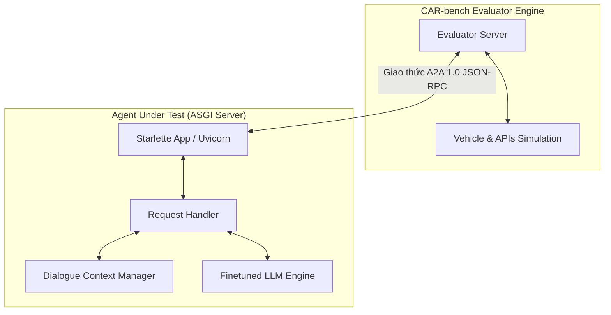
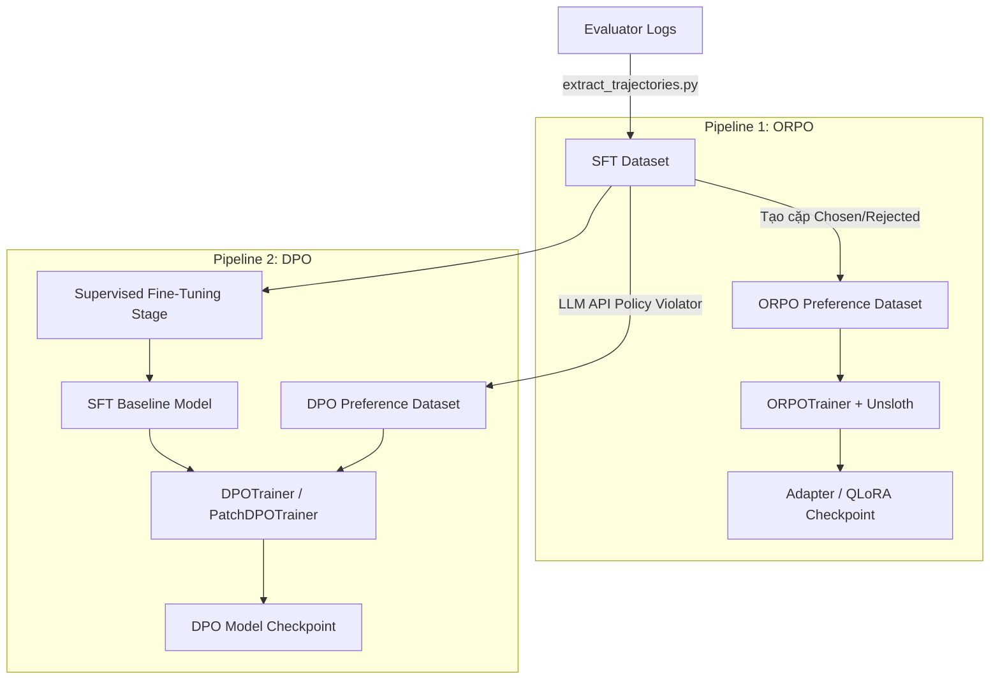

# Tài liệu Thiết kế Kỹ thuật (DRD): Kiến trúc Hệ thống và Tối ưu hóa CAR-bench Agent

## 1. Kiến trúc Hệ thống Tổng thể

Hệ thống CAR-bench hoạt động theo mô hình Tương tác Tác nhân với Tác nhân (Agent-to-Agent - A2A), kết nối thông qua giao thức HTTP JSON-RPC.



### 1.1. Starlette App / Uvicorn Server
Lớp giao tiếp biên của Agent Under Test, khởi chạy một máy chủ ASGI tiếp nhận các yêu cầu JSON-RPC từ Evaluator. Lớp này định nghĩa hai route chính:
- `/jsonrpc`: Nơi xử lý các lệnh gọi RPC như `execute` (xử lý lượt hội thoại tiếp theo) và `cancel` (kết thúc và dọn dẹp tài nguyên của phiên).
- `/.well-known/agent-card`: Cung cấp thông tin thẻ Agent (AgentCard) mô tả tên tác nhân, các tính năng và phiên bản giao thức được hỗ trợ.

### 1.2. Dialogue Context Manager (Trình Quản lý Ngữ cảnh)
Bộ nhớ lưu trạng thái hội thoại. Vì Evaluator chạy song song nhiều kịch bản, Context Manager sử dụng một bản đồ lưu trữ `ctx_id_to_messages` ánh xạ từ `context_id` (mỗi phiên chạy) sang danh sách các lượt hội thoại trước đó. Bộ nhớ này sẽ được giải phóng hoàn toàn khi nhận được sự kiện `cancel` từ Evaluator để tránh rò rỉ bộ nhớ.

---

## 2. Đặc tả Chi tiết Giao thức A2A 1.0

### 2.1. Cấu trúc Message và Part
Mọi gói tin A2A được gửi và nhận dưới dạng một danh sách các `Part` trong đối tượng `Message`. Có hai loại thành phần chính:
- **text Part:** Chứa chuỗi văn bản thuần túy (ví dụ: chỉ thị hệ thống, hội thoại của người dùng hoặc câu trả lời cuối cùng của tác nhân).
- **data Part:** Chứa chuỗi JSON đại diện cho dữ liệu cấu trúc (ví dụ: danh sách công cụ định nghĩa, danh sách lệnh gọi công cụ, hoặc kết quả thực thi công cụ).

### 2.2. Quy trình Hội thoại Lượt Đầu tiên (Task Initialization)
Evaluator khởi tạo phiên bằng cách gửi một tin nhắn chứa **hai thành phần**:
1. Một `text Part` chứa cả System Prompt (chứa 19 chính sách) và User Request dưới dạng:
   ```
   System: <các chính sách và hướng dẫn của CAR-bench>

   User: <yêu cầu công việc ban đầu của hành khách>
   ```
2. Một `data Part` chứa danh sách công cụ được định nghĩa theo định dạng OpenAI Function Calling:
   ```json
   {
     "tools": [
       {
         "type": "function",
         "function": {
           "name": "adjust_sunroof",
           "description": "Điều chỉnh cửa sổ trời...",
           "parameters": { ... }
         }
       }
     ]
   }
   ```

### 2.3. Quy trình Phản hồi từ Tác nhân (Outbound Message)
Tác nhân phân tích lượt đi và trả về phản hồi dưới các dạng:
- **Chỉ gọi công cụ:** Một `data Part` chứa danh sách công cụ cần kích hoạt:
  ```json
  {
    "tool_calls": [
      {
        "tool_name": "adjust_sunroof",
        "arguments": { "state": "closed" }
      }
    ]
  }
  ```
- **Chỉ trả lời hội thoại:** Một `text Part` chứa phản hồi văn bản tự nhiên gửi tới hành khách.
- **Kết hợp:** Gửi cả `text Part` giải thích hành động và `data Part` thực thi công cụ.

### 2.4. Kết quả Thực thi Công cụ (Inbound Tool Results)
Sau khi tác nhân gửi yêu cầu gọi công cụ, Evaluator chạy giả lập trong môi trường xe hơi và trả về kết quả dưới dạng một `data Part` ở lượt tiếp theo:
```json
{
  "tool_results": [
    {
      "tool_name": "adjust_sunroof",
      "tool_call_id": "call_abc123",
      "content": "{\"status\": \"success\", \"message\": \"Sunroof closed successfully\"}"
    }
  ]
}
```

---

## 3. Thiết kế Pipeline Huấn luyện và Căn chỉnh (Alignment)

Để tác nhân tự động tuân thủ 19 chính sách phức tạp mà không làm tăng độ dài prompt hoặc tăng chi phí inference, hệ thống triển khai hai hướng huấn luyện chuyên biệt.



### 3.1. Trích xuất Dữ liệu Hội thoại (`extract_trajectories.py`)
Tập tin script quét qua các thư mục log kết quả của Evaluator (định dạng JSON lồng nhau), trích xuất các lượt hội thoại thành công (đạt điểm thưởng reward tối đa) để làm tập dữ liệu huấn luyện SFT hoặc làm chuỗi hành vi "Chosen" cho DPO/ORPO.

### 3.2. Thiết kế Tinh chỉnh Preference Optimization

#### 3.2.1. ORPO (Odds Ratio Preference Optimization)
ORPO kết hợp pha học có giám sát (SFT) và pha căn chỉnh hành vi (Preference Alignment) vào làm một bước huấn luyện duy nhất bằng cách cộng thêm tổn hao tỷ số khả dĩ (Odds Ratio loss) trực tiếp vào mục tiêu SFT. Điều này giúp loại bỏ nhu cầu cần mô hình tham chiếu (Reference Model), tiết kiệm tới 50% VRAM trong quá trình train.
- **Tập dữ liệu yêu cầu:** Các cặp `(prompt, chosen, rejected)`.
- **Siêu tham số nhạy cảm:** Hệ số phạt Odds Ratio ($\lambda$ hay `beta` trong ORPOTrainer) được cấu hình ở mức `0.1` và tốc độ học từ `5e-6` đến `1e-5`.

#### 3.2.2. DPO (Direct Preference Optimization)
Quy trình hai giai đoạn truyền thống:
1. **Giai đoạn 1 (SFT):** Huấn luyện mô hình cơ sở học cách hội thoại và gọi công cụ dựa trên dữ liệu thành công.
2. **Giai đoạn 2 (DPO):** Căn chỉnh mô hình SFT bằng cách sử dụng `DPOTrainer`. Để giải quyết vấn đề thiếu dữ liệu lỗi ("Rejected"), hệ thống tích hợp một chương trình tạo sinh dữ liệu bằng LLM (LLM Rejected Generator). Chương trình này sử dụng API của mô hình lớn để viết lại các phản hồi đúng (Chosen) thành các phản hồi vi phạm chính sách của CAR-bench (ví dụ: tự ý mở cửa xe, bỏ qua bước xác nhận thông tin nhạy cảm), tạo ra tập dữ liệu so sánh ưu tiên chất lượng cao.

### 3.3. Tối ưu hóa bộ nhớ GPU và Đóng gói (Export)
- **Hạ tầng hỗ trợ:** Huấn luyện trên Kaggle/Colab sử dụng Unsloth để tăng tốc độ huấn luyện lên 2-4 lần và giảm tài nguyên VRAM cần thiết.
- **Đóng gói LoRA & QLoRA:** Lưu trữ các tệp trọng số adapter riêng biệt để người dùng có thể linh hoạt nạp/hủy nạp các lớp căn chỉnh chính sách.
- **Xuất GGUF:** Hỗ trợ script gộp trọng số (Merge weights) và lượng tử hóa 4-bit (`Q4_K_M`) thành tệp định dạng GGUF để chạy nhẹ nhàng trên phần cứng CPU/GPU cục bộ của xe hơi hoặc môi trường vLLM.
